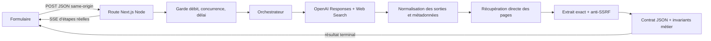

# Architecture de la release candidate

État décrit : release candidate premium du 28 août 2026.

## Principes

L’architecture est volontairement une boucle verticale unique. Elle optimise la démonstration d’un dossier public fiable, pas une plateforme de veille générale. Ses invariants sont : aucune affirmation visible sans preuve directe ; aucune fusion silencieuse d’identités ; aucune confusion entre silence documentaire et panne technique ; aucune clé côté navigateur ; coût et durée bornés.

## Vue d’ensemble

## Frontière navigateur

`src/app/research-form.tsx` porte uniquement l’expérience interactive : type, nom, contexte, validation accessible, lecture robuste d’un flux SSE fragmenté, chronomètre, annulation et rendu. Le navigateur ne connaît ni SDK fournisseur ni secret. À la réception, il revérifie la cohérence du dossier avant affichage : un fait doit pointer vers une preuve, la preuve vers une source ouvrable, et l’extrait visible doit être identique au texte de l’affirmation. Un conflit exige aussi deux valeurs, deux affirmations, deux chemins de page et deux empreintes de document distincts, une entité, une métrique, une période, un périmètre, une unité, une devise et une nature publiée/estimée compatibles. Les paramètres de requête ne créent pas une seconde page.

Les états d’attente correspondent à des événements serveur : demande reçue, résolution d’identité, recherche, lecture des sources, construction, contrôle final. Il n’existe ni pourcentage simulé ni progression temporelle décorative. L’annulation ferme la requête par `AbortController` ; annulation et erreur ont priorité sur la dernière étape reçue. Sous 920 px, la progression suit directement le formulaire. Le focus terminal rejoint immédiatement le début du résultat ou le message d’erreur.

## Frontière HTTP

`src/app/api/research/route.ts` utilise le runtime Node, un plafond Vercel de 180 secondes et un abandon applicatif à 150 secondes. Le corps JSON est limité à 1 024 octets. `Origin` et `Sec-Fetch-Site` empêchent l’usage cross-site ; les réponses sont `no-store`. Les erreurs synchrones deviennent des statuts HTTP typés ; une exécution admise diffuse ensuite des événements SSE et un seul terminal `completed` ou `failed`.

`src/server/research/request-guard.ts` accepte au plus huit requêtes par dix minutes et par empreinte IP, ainsi que deux exécutions simultanées par instance. L’IP brute n’est pas conservée : un SHA-256 avec sel éphémère sert de clé mémoire. Cette protection réduit l’abus du prototype ; elle n’est pas une limitation distribuée.

## Fournisseur et recherche

Le seul chemin fournisseur est OpenAI `gpt-5.6-luna`, via AI SDK Core, le provider OpenAI Responses et l’outil Web Search. La génération utilise :

- `store: false` ;
- raisonnement bas ;
- sortie structurée ;
- un appel HTTP fournisseur ;
- entre une et quatre actions Web Search distinctes ;
- délai fournisseur de 90 secondes ;
- cible de trois à six faits et deux pages distinctes lorsque la matière existe.

Le schéma de transport reste compatible avec Structured Outputs : les URL y sont des chaînes bornées, puis passent dans la validation locale stricte. Une sortie partielle n’est récupérée que si son JSON peut être normalisé sans inventer d’identité, de source, d’extrait ou de valeur. Toutes les autres anomalies échouent fermées.

Les métadonnées des recherches, inspections et citations sont comptabilisées. Une URL structurée peut aider à retrouver une page, mais ne devient jamais une preuve par sa seule présence.

### Pourquoi une seule verticale fournisseur

OpenAI est le fournisseur de Production pour une verticale unique, mesurable et maîtrisée. Un probe historique a vérifié des capacités OpenAI et Gemini, mais aucun benchmark métier annoté sur le même jeu n’établit une supériorité universelle d’un modèle. Ajouter Gemini sans gain de qualité démontré augmenterait la variabilité, le coût, la latence, la réconciliation et les modes de panne. Un accord entre deux modèles ne constitue pas deux preuves indépendantes : la frontière de confiance reste la récupération et la validation serveur des pages sources. Gemini demeure un candidat pour un benchmark futur ou un fallback calibré, après comparaison aveugle sur le même jeu annoté.

## Vérification directe des sources

`src/server/research/source-security.ts`, `source-transport.ts` et `source-content.ts` forment une frontière indépendante du texte du modèle.

1. Parse d’une URL absolue `https`.
2. Refus des identifiants intégrés, ports non standards, hôtes locaux, réseaux privés, adresses réservées et encodages ambigus.
3. Résolution DNS avant connexion et fixation de l’adresse validée afin de réduire le DNS rebinding.
4. Revalidation à chaque redirection, deux redirections au maximum.
5. Délai global de 20 secondes, corps de 512 Kio maximum, HTML uniquement.
6. Extraction du texte visible et recherche contiguë de l’extrait exact, borné à 500 caractères.
7. Conservation du titre réellement lu, de l’URL finale, de la date de consultation, d’un localisateur et du condensat du texte normalisé.

La citation fournisseur seule est insuffisante. Une page inaccessible, un extrait absent ou une URL non sûre fait disparaître l’affirmation ; le nombre de preuves rejetées devient une inconnue visible. Le runtime ne contourne pas les protections d’accès et marque la conformité de collecte `not_verified` : l’accès public et la preuve technique ne sont pas présentés comme une validation juridique des conditions du site.

## Résolution d’identité

Le nom seul n’autorise pas une identité résolue. Le type demandé, le contexte libre et au moins une preuve directe doivent converger. Un type contradictoire ou plusieurs candidats crédibles déclenche `ambiguous` ou `insufficient_context`. Dans ce mode, les candidats restent séparés et les affirmations servent uniquement à expliquer l’ambiguïté ; aucun dossier factuel confiant n’est rendu.

Le silence produit `not_found_within_scope`, zéro fait et zéro source. La panne réseau, l’erreur fournisseur ou une sortie invalide produit `technical_failure`, jamais un faux dossier vide.

## Composition du dossier

Le contrat canonique est `docs/contracts/research-dossier.schema.json`, validé par Ajv. Les types TypeScript sont générés et contrôlés contre ce schéma. `src/domain/runtime-invariants.ts` ajoute les règles qui traversent plusieurs objets : références existantes, correspondance entité/preuve/source, absence de fait sans preuve, visibilité des contradictions et cohérence des statuts.

Un succès `complete_within_scope` exige trois à six faits métier uniques, deux catégories, deux pages, deux familles d’éditeurs et aucune contradiction ouverte. Un résultat prouvé mais plus pauvre devient `partial`. Les catégories manquantes et preuves rejetées sont affichées comme inconnues.

Les contradictions regroupent uniquement des valeurs incompatibles pour le même sujet, le même prédicat, la même période, le même périmètre, la même unité, la même devise, la même définition et la même nature publiée ou estimée. La release limite cette qualification aux niveaux de `revenue` et `workforce` et à une période annuelle unique explicitement nommée civile ou fiscale. Chaque extrait doit relier, dans la même proposition, le libellé du sujet attendu, la métrique, sa valeur et son unité ou sa devise. Signature métrique, valeur numérique exacte et finie, devise reconnue (`EUR`, `USD`, `GBP`, `CHF`, `CAD`, `AUD`, `JPY`, `CNY`), portée explicite — entité, groupe consolidé, filiale ou maison-mère —, base d’observation de l’effectif et nature sont redérivées de l’extrait exact ; les métadonnées du modèle ne suffisent donc jamais à créer un conflit. Aucune conversion de devise n’est effectuée. Année nue, TTM/LTM, approximation, intervalle, taux, croissance, sous-période, population ou base d’effectif hors grammaire, métrique ou définition hors allowlist, devise différente ou dimension absente ou contredite deviennent `indetermination`. Toutes les versions et leurs pages restent visibles, aucune n’entre dans le résumé et aucune valeur n’est sélectionnée. La fraîcheur vaut `current` seulement si la formulation actuelle et la date d’observation exacte sont prouvées ; sinon elle reste `historical` ou `unknown`.

## Coût, erreurs et observabilité

Le reçu public expose appels, actions Web, pages récupérées, jetons, durées et coût estimé. Un dossier estimé au-dessus de `0,10 $` est rejeté. Le barème est daté et ses limites accompagnent la valeur.

Les reçus d’échec ne contiennent ni entrée, ni prompt, ni extrait. Ils conservent seulement catégorie, étape, code public, présence d’un identifiant fournisseur, métriques non sensibles et condensat éventuel. Il n’existe ni base, ni télémétrie distante, ni journal métier persistant.

## Déploiement

Le projet cible Vercel avec Node 24. Les métadonnées Vercel observées le 28 août 2026 montrent uniquement `OPENAI_API_KEY`, de type `Sensitive`, pour Preview et Production ; aucune valeur n’a été lue. Aucune variable Gemini ni variable fournisseur `NEXT_PUBLIC_*` n’est présente. Les en-têtes globaux appliquent notamment CSP, interdiction d’embarquement, `nosniff`, politique de permissions et politique de référent. Le même déploiement validé en Preview est promu vers <https://genial-deep-research.vercel.app>.

## Choix écartés

- Gemini : aucun gain de qualité produit démontré sur le même jeu annoté ne justifie aujourd’hui une seconde voie, sa variabilité, sa réconciliation et de nouveaux modes de panne ; aucune supériorité universelle d’OpenAI n’est revendiquée.
- Base ou historique : contraire à la minimisation des données pour l’épreuve.
- Queue : latences observées compatibles avec une requête longue streamée.
- Résumé généré séparément : risque d’introduire des faits sans preuve.
- Capture HTML comme preuve durable : l’URL, l’extrait, la date et le condensat sont conservés ; la page complète ne l’est pas pour limiter données et droits.

## Références primaires

- [OpenAI — modèle gpt-5.6-luna](https://developers.openai.com/api/docs/models/gpt-5.6-luna)
- [OpenAI — Web Search](https://developers.openai.com/api/docs/guides/tools-web-search)
- [OpenAI — Structured Outputs](https://developers.openai.com/api/docs/guides/structured-outputs)
- [OpenAI — tarifs API](https://developers.openai.com/api/docs/pricing)
- [OpenAI — contrôle de stockage et rétention des données API](https://developers.openai.com/api/docs/guides/your-data)
- [Vercel — durée des fonctions](https://vercel.com/docs/functions/configuring-functions/duration)
- [Vercel — promotion d’un déploiement](https://vercel.com/docs/deployments/promoting-a-deployment)
- [Next.js — en-têtes](https://nextjs.org/docs/app/api-reference/config/next-config-js/headers)
