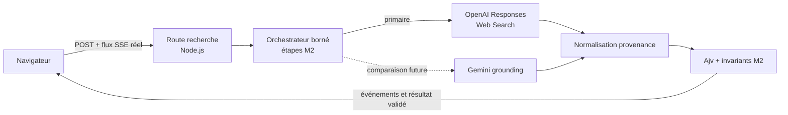

# Architecture minimale — M3

Date de vérification : **2026-08-26**

Statut : **baseline technique locale ; aucune recherche métier ; G3 non validé**

## 1. Résumé

L’application est un monolithe Next.js App Router en TypeScript strict. Les pages et layouts restent des composants serveur par défaut. Le navigateur ne recevra que l’interface et un flux d’événements ; les secrets, fournisseurs, validation et orchestration restent dans le runtime Node.js.

La voie initiale future sera OpenAI `gpt-5.6-luna` via AI SDK Core, le package direct `@ai-sdk/openai`, Responses API et Web Search. Gemini reste un adaptateur de comparaison ou de repli non branché au chemin critique. M3 installe et type ces frontières sans appeler de fournisseur et sans créer de route de recherche.

Le JSON Schema [`research-dossier.schema.json`](contracts/research-dossier.schema.json) reste l’unique contrat canonique. Ajv assure la validation structurelle à l’exécution ; `tools/verify-m2-contract.ps1` conserve les invariants référentiels et sémantiques.

## 2. Exigences motrices

- traçabilité `Source → Evidence → Claim → présentation` jusqu’à l’écran ;
- aucun fait final sans preuve finale vérifiable ;
- états explicites pour ambiguïté, conflit, silence, péremption et panne technique ;
- attente longue décrite uniquement par des opérations réelles M2 ;
- aucune persistance métier, aucun compte et une recherche à la fois ;
- clés fournisseur uniquement côté serveur, absentes du build et du client ;
- timeout, budget d’appels et reprises bornés ;
- résultat partiel autorisé, mais seulement avec éléments déjà validés ;
- déploiement futur compatible Vercel sans le créer en M3.

## 3. Composants et responsabilités

| Composant | Présent en M3 | Responsabilité |
|---|---:|---|
| `src/app` | oui | Page de baseline, layout serveur et route de santé sans dépendance externe. |
| `src/domain` | oui | Validation Ajv du schéma M2 et types générés depuis ce schéma. Aucune règle métier dupliquée. |
| `src/server/ai` | oui | Fabriques serveur paresseuses, modèle primaire et limites d’exécution. Aucune génération. |
| Route de recherche Node | non | Future frontière HTTP, validation d’entrée, orchestration et flux d’événements. |
| Orchestrateur de recherche | non | Futures étapes M2, budgets, timeout, collecte et composition. |
| Adaptateurs OpenAI/Gemini | partiel | Packages directs et fabriques sans appel ; normalisation future non implémentée. |
| Stockage métier | non | Aucun stockage, historique, cache nominatif ou reprise durable. |

## 4. Frontière navigateur / serveur

Le navigateur ne connaît ni `OPENAI_API_KEY`, ni `GEMINI_API_KEY`, ni les objets SDK fournisseur. Aucun identifiant fournisseur n’utilise `NEXT_PUBLIC_*`. Les composants client seront introduits uniquement pour le formulaire futur, la lecture du flux et les interactions locales.

Les variables non `NEXT_PUBLIC_*` restent disponibles dans l’environnement Node serveur. Les variables publiques Next.js sont incorporées au bundle lors du build et figées à ce moment ; elles sont donc interdites pour les fournisseurs. La validation d’une clé est paresseuse : elle se produit dans la fabrique serveur au moment d’utiliser le fournisseur, pas à l’import ni au build.

## 5. Flux futur d’une recherche

Séquence future : valider l’entrée ; créer un contexte en mémoire lié à la requête ; émettre une étape réelle ; appeler le fournisseur dans le budget ; conserver sources, usage et métadonnées ; normaliser sans inventer ; valider ; émettre un résultat complet, partiel ou une erreur typée ; libérer l’état à la fermeture de la requête.

## 6. Conservation de la provenance

OpenAI devra exposer les sources retournées par Web Search et les métadonnées de réponse. La requête devra utiliser `store: false` et la Responses API. Les citations affichées seront construites depuis les objets structurés, jamais générées librement dans la prose.

Gemini expose `sources` et `providerMetadata.google.groundingMetadata` dans le package AI SDK stable observé. Les champs Google `groundingChunks` et `groundingSupports` relient segments et sources, mais une URL `vertexaisearch.cloud.google.com` non résolue ne satisfait pas le contrat final M2.

Le schéma M2 ne possède pas de champ générique pour une copie brute de toute métadonnée fournisseur. La future implémentation doit donc conserver ces métadonnées dans la mémoire de requête pendant la normalisation, écrire les champs contractuels `provider_url`, `resolved_url`, `canonical_url`, preuve et reçu, puis échouer fermé si une information nécessaire ne peut pas être représentée. Ajouter un champ au dossier exigerait une révision explicite du contrat, pas une propriété parallèle.

## 7. Validation du contrat

- canonique : `docs/contracts/research-dossier.schema.json`, Draft 7 ;
- structure runtime : Ajv `8.20.0` avec `ajv-formats` pour `uri` et `date-time` ;
- types : génération déterministe par `json-schema-to-typescript`, puis comparaison exacte par `contract:types:check` ;
- sémantique : `tools/verify-m2-contract.ps1`, six fixtures synthétiques et cinq mutations négatives ;
- frontière future : valider les sorties fournisseur normalisées avant tout événement de résultat ou rendu.

Le type généré est un artefact dérivé. Il ne devient jamais une deuxième définition du contrat.

`tsconfig.json` conserve `strict`, `noUncheckedIndexedAccess` et `exactOptionalPropertyTypes`. `skipLibCheck` ne masque que les déclarations tierces AI SDK incompatibles avec `exactOptionalPropertyTypes`, pas le code projet. Ajv garde son mode strict sauf `strictTypes`, désactivé parce que certains sous-schémas conditionnels M2 utilisent `properties` sans répéter `type: object` ; le schéma canonique n’est pas modifié et sa validation reste effective.

## 8. Erreurs et fail-closed

- entrée invalide : rejet avant fournisseur ;
- clé absente : erreur de configuration serveur au premier usage, jamais au build ;
- timeout, quota, authentification ou réponse invalide : `technical_failure`, jamais silence ;
- provenance incomplète, URL finale non vérifiable ou métadonnée perdue : fait rejeté ;
- dossier structurellement invalide ou invariant M2 violé : aucun dossier final ;
- résultat partiel : uniquement les éléments déjà validés, avec limites et raison d’arrêt ;
- reprise : au plus une reprise par opération et lien `retry_of` obligatoire ; aucun retry infini.

Politique initiale réversible : timeout applicatif `240 000 ms`, huit appels fournisseur maximum, une reprise maximum par opération. Le plafond futur de fonction visé est `300 s`, laissant une marge de fermeture. Ces valeurs devront être mesurées en boucle verticale avant G3.

## 9. Usage, coût et latence

Le futur reçu M2 sera construit à partir de mesures brutes : horodatages monotones, durée totale et par étape, nombre d’appels, tentatives, tokens fournisseur, recherches facturables lorsque disponibles, modèle retourné et coût calculé depuis un barème versionné et daté. Un coût non calculable reste inconnu ; il n’est pas inventé.

Aucun prompt, dossier complet, extrait de preuve ou donnée nominative ne doit être journalisé. En M3, aucun outil de télémétrie distante n’est installé ; les commandes Next.js désactivent leur télémétrie.

## 10. Secrets

Seuls `OPENAI_API_KEY` et `GEMINI_API_KEY` sont attendus. `.env.example` conserve leurs noms avec valeurs vides. Le magasin DPAPI M1 reste extérieur, non suivi et non lu par l’application. La configuration serveur importe les SDK directs et lit une clé seulement lorsque la fabrique correspondante est appelée.

Le build sans secrets est un invariant. Le contrôle du bundle client rejette les noms de clés, formes de clés et endpoints fournisseur. Les scans WorkingTree, Staged et Tracked restent actifs.

## 11. Streaming

Le transport initial prévu est une réponse HTTP `text/event-stream` à une requête POST, consommée avec `fetch` et `ReadableStream`. Chaque événement porte une étape M2 réelle (`interpretation`, `candidate_search`, `identity_resolution`, `collection`, `extraction`, `reconciliation`, `verification`, `composition`), un statut et une mesure ; aucun pourcentage n’est émis.

AI SDK Core `streamText` sait produire un flux serveur, mais son flux textuel ne sera pas directement promu en faits. Le serveur traduit les événements fournisseur en événements applicatifs et n’émet un résultat métier qu’après validation. Le flux se termine au timeout, à l’abandon client, au succès ou à l’erreur ; il n’est jamais infini.

## 12. Déploiement cible et limites

Vercel est la cible initiale théorique, sans projet ni connexion en M3. Le runtime Node.js est le défaut Next.js et Vercel, supporte le streaming et l’ensemble des API Node. Le runtime Edge est écarté par défaut : surface API plus étroite et aucun gain démontré pour une orchestration longue dépendante de SDK serveur.

Au 26 août 2026, Vercel documente Node `24.x` comme LTS par défaut ; `package.json` fixe donc le major `24.x`. Avec Fluid Compute activé, les durées documentées sont `300 s` par défaut et maximum en Hobby, `300 s` par défaut et `800 s` maximum en Pro/Enterprise. Sans Fluid Compute : Hobby `10 s` par défaut / `60 s` maximum, Pro `15 s` / `300 s`, Enterprise `15 s` / `900 s`. Le plan réel et Fluid Compute sont inconnus : ils devront être confirmés avant déploiement.

Pour Next.js App Router, `export const maxDuration = <secondes>` sur la route est la méthode directe documentée. La route de santé utilise `5 s`. La future route de recherche visera `300 s`, sous réserve du plan. Si les mesures dépassent régulièrement `240 s`, la requête streamée n’est plus adaptée : réviser vers queue, état durable et polling plutôt que masquer les interruptions.

## 13. Dépendances retenues

Dist-tags `latest` du registre npm interrogés le 26 août 2026 ; seules des versions stables exactes figurent au lockfile.

| Élément | Version retenue | Motif |
|---|---:|---|
| Node.js | `24.x` ; référence `24.20.0` | LTS actuelle et version déployable Vercel ; Node Current observé `26.8.0` non encore proposé par Vercel. |
| pnpm | `11.24.0` | gestionnaire stable, versionné par Corepack et lockfile unique. |
| Next.js | `16.3.3` | App Router, routes Node, composants serveur et build de production. |
| React / React DOM | `19.2.8` | versions stables cohérentes avec Next.js. |
| AI SDK Core | `7.0.79` | streaming, sorties structurées, sources et API fournisseur uniforme limitée. |
| `@ai-sdk/openai` | `4.0.47` | package direct ; Responses par défaut, Web Search, `store: false`, sources et métadonnées. |
| `@ai-sdk/google` | `4.0.51` | package direct ; grounding, sources et provider metadata ; chemin non critique. |
| Ajv / formats | `8.20.0` / `3.0.1` | validation JSON Schema Draft 7 et formats utilisés par M2. |
| Zod | `4.4.3` | peer runtime exigé par AI SDK ; interdit comme second contrat M2. |
| TypeScript | `6.0.3` | version stable la plus récente compatible avec la chaîne ESLint Next actuelle (`<6.1`). |
| ESLint / config Next | `9.39.5` / `16.3.3` | version la plus récente acceptée par les plugins transitifs Next ; ESLint 10 reste incompatible avec leurs peer ranges. |
| Vitest | `4.1.11` | tests Node rapides, sans navigateur ni service externe. |
| json-schema-to-typescript | `15.0.4` | types dérivés et contrôle de dérive sans recopier le contrat. |

Le script d’installation autorise uniquement le postinstall transitif `unrs-resolver`, requis par la résolution ESLint. Aucun autre script de dépendance n’est approuvé implicitement.

## 14. Alternatives rejetées pour la baseline

| Choix | Alternative | Motif borné |
|---|---|---|
| Next.js monolithe | frontend et backend séparés | Deux déploiements et un contrat réseau supplémentaires sans besoin d’échelle prouvé. À réviser si les traitements sortent durablement des limites HTTP. |
| AI SDK + packages directs | REST direct | AI SDK fournit streaming, sources, structured outputs et adaptateurs stables. Son risque de perte de métadonnées impose une vérification avant G3 ; REST reste le repli si ce risque se matérialise. |
| OpenAI primaire | Gemini primaire | M1 a observé URLs directes, coût inférieur et latence acceptable côté OpenAI. Ce n’est pas une preuve de qualité métier et le choix reste réversible. |
| requête longue streamée | queue + polling | Une recherche à la fois, aucune persistance et durée visée sous 240 s rendent le flux plus simple. Une queue devient nécessaire pour reprise durable, dépassement régulier ou résilience aux déconnexions. |
| mémoire de requête | base de données | Minimise données personnelles, surface de sécurité et complexité. Sacrifie historique et reprise après rupture ; toute persistance future exige un arbitrage explicite. |

AI Gateway, abstraction multi-provider générique, ORM, Redis, queue, bibliothèque UI, framework CSS, SDK d’hébergement et télémétrie distante sont exclus faute de besoin M3.

## 15. Points de révision

- vérifier par un appel M4 autorisé que `@ai-sdk/openai` conserve toutes les sources et métadonnées nécessaires avec `gpt-5.6-luna` ;
- mesurer qualité, coût, latence et nombre d’appels sur requêtes inconnues avant toute validation produit ;
- confirmer plan Vercel, Fluid Compute, région, durée et comportement de déconnexion avant déploiement ;
- remplacer AI SDK par REST direct si la provenance est tronquée ou transformée sans accès brut suffisant ;
- réviser timeout et budget uniquement à partir de mesures ;
- introduire queue/persistance seulement si une durée ou reprise durable le justifie ;
- réévaluer TypeScript 7 et ESLint 10 lorsque la chaîne Next les accepte sans peer conflict ;
- auditer chaque mise à jour de lockfile et bloquer toute vulnérabilité runtime haute ou critique.

## Sources primaires consultées

- Node.js : [releases](https://nodejs.org/en/about/previous-releases), [index des distributions](https://nodejs.org/dist/index.json) ;
- Next.js : [installation](https://nextjs.org/docs/app/getting-started/installation), [App Router](https://nextjs.org/docs/app), [Server et Client Components](https://nextjs.org/docs/app/getting-started/server-and-client-components), [route segment config](https://nextjs.org/docs/app/api-reference/file-conventions/route-segment-config), [variables d’environnement](https://nextjs.org/docs/pages/guides/environment-variables), [migration 16](https://nextjs.org/docs/app/guides/upgrading/version-16) ;
- React : [versions](https://react.dev/versions) ;
- AI SDK : [OpenAI provider](https://ai-sdk.dev/providers/ai-sdk-providers/openai), [Google provider](https://ai-sdk.dev/providers/ai-sdk-providers/google-generative-ai), [structured data](https://ai-sdk.dev/docs/ai-sdk-core/generating-structured-data), [`jsonSchema`](https://ai-sdk.dev/docs/reference/ai-sdk-core/json-schema), [`streamText`](https://ai-sdk.dev/docs/reference/ai-sdk-core/stream-text) ;
- OpenAI Docs : [`gpt-5.6-luna`](https://developers.openai.com/api/docs/models/gpt-5.6-luna), [Responses API](https://developers.openai.com/api/reference/resources/responses/methods/create) ;
- Google AI : [API versions](https://ai.google.dev/gemini-api/docs/api-versions), [Grounding with Google Search](https://ai.google.dev/gemini-api/docs/google-search), [GenerateContent response metadata](https://ai.google.dev/api/generate-content) ;
- Vercel : [durées](https://vercel.com/docs/functions/configuring-functions/duration), [runtimes](https://vercel.com/docs/functions/runtimes), [versions Node](https://vercel.com/docs/functions/runtimes/node-js/node-js-versions), [Fluid Compute](https://vercel.com/docs/fluid-compute) ;
- npm : dist-tags et métadonnées obtenus depuis [`registry.npmjs.org`](https://registry.npmjs.org/).
